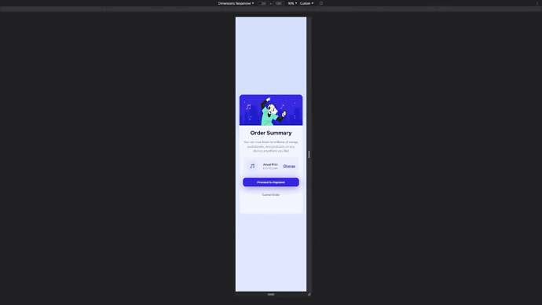

<h1 align="center">
    <a href="https://devpedrom.github.io/responsive-price-card/"> </img> Responsive Price Card</a> 
</h1>

<a href="https://github.com/devpedrom/responsive-price-card/blob/main/LICENSE">&nbsp;
</a>

 

 <a href="#blush-why">Why</a> •
 <a href="#zap-tech-stack">Tech Stack</a> • 
 <a href="#clapper-preview">Preview</a> •
 <a href="#book-autor">Autor</a> • 
 <a href="#rocket-progress">Progress</a> 

<strong>🚀 Responsive price card inspired by the Mentor Frontend Template.</strong>

 

<kbd></img></kbd>

## :blush: **Why?**

This project was a clone of Frontend Mentor, in which I developed a 100% responsive card. Training semantic HTML5, CSS3 Flexbox, Media-Query, and other concepts

## :clapper: **Preview**

## :zap: **Tech Stack**

&nbsp;

## :rocket: **Progress**

## :book: **Autor**

Developed by <a href="https://github.com/devpedrom"><strong> Pedro Mendes</strong></a>, according to the Frontend Mentor <a href= "https://www.frontendmentor.io/"> <strong>Frontend Mentor</strong></a> template.</ p>

## :handshake: **Connect with me**

  
  
  
    

## :money_with_wings: **Contribute with me**

  
  

